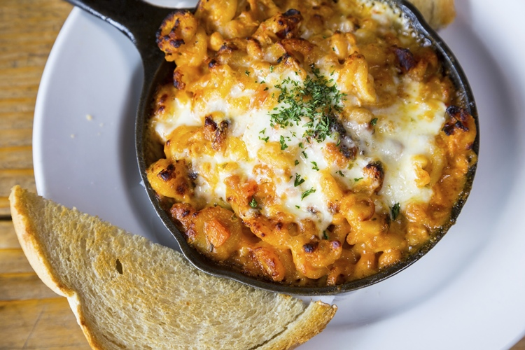

# Etapa1_PV_Pandas_Creativos_Grupo_2
Reconocimiento de nuestro entorno y Armado de equipos con SCV

# Laura Hernandez

## ¿Quién soy?
**Rol: Diseñadora de Sonido**

Ubicación: Lauro de freitas, Brasil

Perfil: Mi nombre es Laura Hernandez, soy tecnóloga en producción multimedia, nací en Villavicencio, Meta, tengo 28 años. Me encanta el arte, especialmente la forma en que la creatividad, la inspiración y el ingenio pueden transmitir un concepto o contar una historia.

Mi correo institucional es lmhernandezrodrigue@unadvirtual.edu.co

Mi comida favorita es el Ajiaco Colombiano.

# Nataly Gómez Rojas 

*Rol seleccionado:*

Diseñador Narrativo, ya que es quien construye la historia en los videojuegos, creando tramas, personajes y situaciones que atrapan al jugador. Además, trabaja en conjunto con los desarrolladores, escritores y artistas para integrar la narrativa con la jugabilidad, logrando una experiencia inmersiva. Lo que más me atrapa de este trabajo es que la labor incluye desde diálogos y antecedentes de personajes, hasta misiones y decisiones que impactan el desarrollo del juego, aportando profundidad y emociones al mundo virtual.

*Información Personal:*

Ubicación: CEAD La Dorada, Caldas.

Perfil: soy Nataly pero me gusta Nat´s, tengo 23 años, soy técnica en Diseño Gráfico y futura Ingeniera Multimedia, además soy creadora de contenido y tengo un emprendimiento hace cuatro años. Mi animal favorito son los perritos y me encanta en Scrapbook, la fotografía y viajar.

Mis datos de contacto: ngomezroj@unadvirtual.edu.co 

*Mi comida favorita:*

# Fabian Berna Perea

**Rol seleccionado**

El rol que seleccionare para la realizacion de esta actividad es el de **programador** debido a que este se encarga de la logica y funcionalidad del juego mediante la creacion del codigo fuente. Ademas de agregar y crear la jugabilidad, movilidad, golpes, saltos, enemigos, mecanicas del juego etc, al mismo tiempo debe asegurarse de que el videojuego funcione correctamente.  

**Información Personal**

**Ubicación:** 
- CIP Turbo, Turbo, Antioquia.

**Perfil:**
- Mi nombre es  Fabian Berna, tengo 21 años, estudiante de Ingeniera Multimedia, Tengo un emprendimiento en donde estampo camisetas, vasos, gorras y otras prendas, me gusta mucho la animacion y el dibujo tambien lamusica en especial el rock espero contribuir ampliamente al equipo en el desarrollo de esta tarea.  

**Contacto** 
- fdbernap@unadvirtual.edu.co
- Cel.3024538226(solo WhatsApp)

**Comida favorita:**
- 

# Stefania Holguin Quiroz

# ¿Quién soy?

Rol: Diseñadora de sistemas

Ubicación: Barbosa, Antioquia

Perfil: Soy tecnóloga en Producción de Multimedia, tengo experiencia en diferentes roles centrados en la experiencia de usuario, el desarrollo FrontEnd y el marketing digital. Soy una persona curiosa y me encanta el nuevo aprendizaje.

Mi correo es: sholguinq@unadvirtual.edu.co

Mi comida favorita son las Pastas Gratinadas:

¡Gracias por la atención prestada!